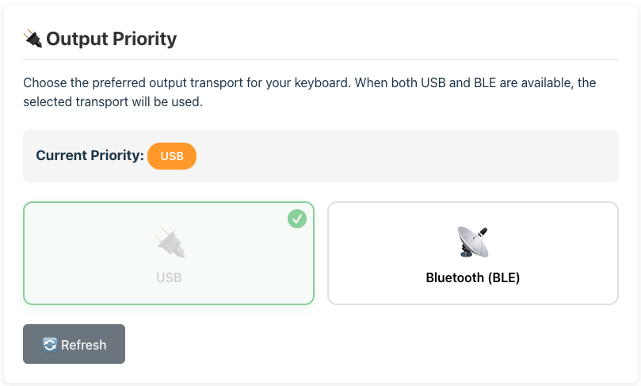
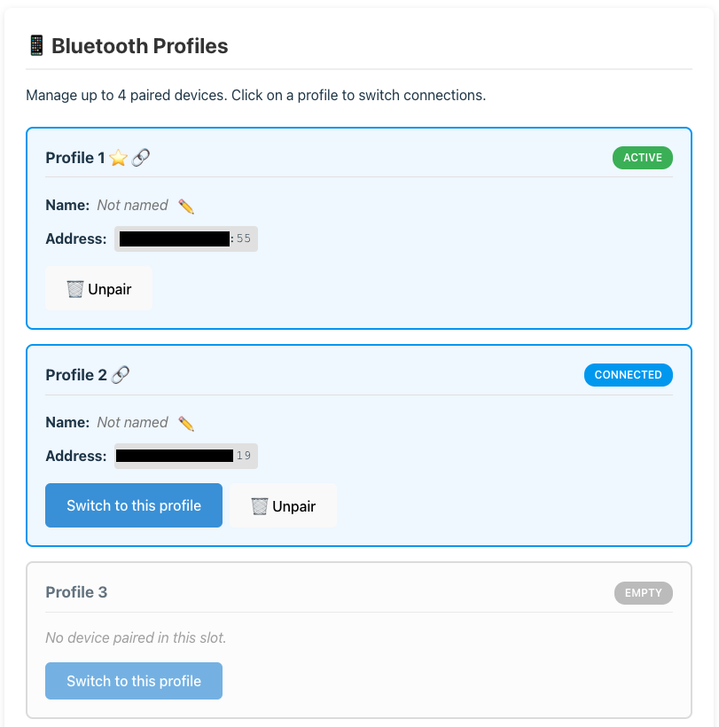

# ZMK BLE Management Module

This ZMK module provides a web-based user interface for managing Bluetooth Low Energy (BLE) connections on your ZMK keyboard. It makes it easy to view paired devices, switch between profiles, customize names, and manage split keyboard connections.

## Features

- **View BLE Profiles**: See all paired devices with connection status
- **Custom Names**: Assign memorable names to your paired devices (saved persistently)
- **Quick Switching**: Easily switch between paired devices
- **Unpair Devices**: Remove unwanted pairings
- **Persistent Storage**: Custom device names are saved and tied to BLE addresses

## Screenshots

| Output Priority Toggle         | Naming, un-pairing and switching profile |
| ------------------------------ | ---------------------------------------- |
|  |                    |

## Setup

You can use this ZMK module with the following setup:

### 1. Add dependency to your `config/west.yml`

```yaml
# config/west.yml
manifest:
  remotes:
    - name: cormoran
      url-base: https://github.com/cormoran
  projects:
    - name: zmk-module-ble-management
      remote: cormoran
      revision: main # or latest commit hash
    # Required: Custom ZMK fork with studio protocol support
    - name: zmk
      remote: cormoran
      revision: v0.3-branch+custom-studio-protocol+ble
      import:
        file: app/west.yml
```

### 2. Enable the module in your `config/<shield>.conf`

```conf
# config/<shield>.conf
# Enable BLE Management Module
CONFIG_ZMK_BLE_MANAGEMENT=y

# Enable Studio custom RPC features
CONFIG_ZMK_STUDIO=y
CONFIG_ZMK_BLE_MANAGEMENT_STUDIO_RPC=y
```

### 3. Use the Web UI

1. Build and flash your firmware with the module enabled
2. Visit the web UI at: `https://cormoran.github.io/zmk-module-ble-management/`
3. Connect your keyboard via Serial (USB)
4. Manage your BLE profiles!

## Development Guide

### Setup

This module uses the standard ZMK workspace layout:

```bash
git clone https://github.com/cormoran/zmk-module-ble-management
cd zmk-module-ble-management
west init -l west --mf west-test-standalone.yml
west update --narrow
west zephyr-export
```

### Testing

**Firmware Tests:**

```bash
# Run all firmware tests
python -m unittest

# Run specific test
python -m unittest test.WestCommandsTests.test_zmk_test
```

**Web UI Tests:**

```bash
cd web
npm install
npm test
npm run lint
```

### Web UI Development

```bash
cd web
npm install
npm run dev  # Start development server at http://localhost:5173
```

The web UI uses:

- React + TypeScript
- Vite for building
- [@cormoran/zmk-studio-react-hook](https://github.com/cormoran/react-zmk-studio) for ZMK communication
- Protocol Buffers for RPC messages

## Configuration Options

| Option                                 | Description                   | Default |
| -------------------------------------- | ----------------------------- | ------- |
| `CONFIG_ZMK_BLE_MANAGEMENT`            | Enable BLE management feature | `n`     |
| `CONFIG_ZMK_BLE_MANAGEMENT_STUDIO_RPC` | Enable Studio RPC interface   | `n`     |

## Architecture

### Firmware Components

- **`src/studio/ble_management_handler.c`**: Main RPC handler
  - Manages BLE profiles using ZMK APIs
  - Stores custom names using Zephyr settings
  - Handles split keyboard operations

- **`proto/zmk/ble_management/ble_management.proto`**: Protocol definition
  - Defines RPC messages for profile management
  - Split keyboard information

### Web UI Components

- **`ProfileManager`**: Displays and manages BLE profiles
- **`SplitManager`**: Manages split keyboard connections

### Data Flow

```
Web UI (React)
  ↕ Serial Connection
ZMK Studio RPC Protocol
  ↕ Custom Subsystem (cormoran_ble)
BLE Management Handler
  ↕ ZMK BLE APIs + Zephyr Settings
Keyboard Firmware
```

## Troubleshooting

### Web UI doesn't connect

- Ensure CONFIG_ZMK_STUDIO=y is set
- Make sure you're using a Serial/USB connection
- Try refreshing the page and reconnecting

### Custom names don't save

- Check that CONFIG_SETTINGS=y is enabled in your build
- Verify flash storage is available on your board

### Split keyboard issues

- Use the "Reset Split Connection" button to clear bonds
- Re-pair the keyboard halves after reset

## Contributing

Contributions are welcome! Please:

1. Fork the repository
2. Create a feature branch
3. Make your changes with tests
4. Run `python -m unittest` and `cd web && npm test`
5. Submit a pull request

## License

MIT License - see [LICENSE](LICENSE) file for details

## Credits

- Built on [ZMK Firmware](https://zmk.dev/)
- Uses [react-zmk-studio](https://github.com/cormoran/react-zmk-studio) by @cormoran
- Created from [zmk-module-template-with-custom-studio-rpc](https://github.com/cormoran/zmk-module-template-with-custom-studio-rpc)

## Support

- [GitHub Issues](https://github.com/cormoran/zmk-module-ble-management/issues)
- [ZMK Discord](https://zmk.dev/community/discord/invite)
